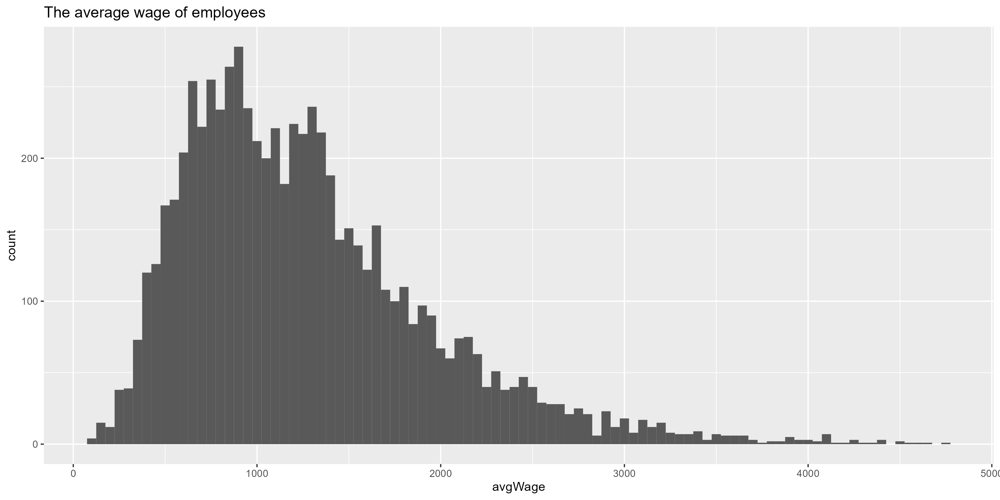

# R Laboratorinis darbas: duomenų vizualizacija

| Variantas | ecoActCode |
|------------- | ------------- |
|16   | 862300 |

### 1. Užduotis

Atsakymas:

Išvados:

### 2. Užduotis

Atsakymas:

Išvados:

### 3. Užduotis

Atsakymas:

Išvados: Šioje srityje tikėjaus, kad bus nors viena įmonė kuri turės vieną apdraustąjį su ypač dideliu atlyginimu, ir smarkiai lenks kitų algos vidurkius, bet taip nėra

### 4. Užduotis

Shiny R aplikacijos nuotrauka:

